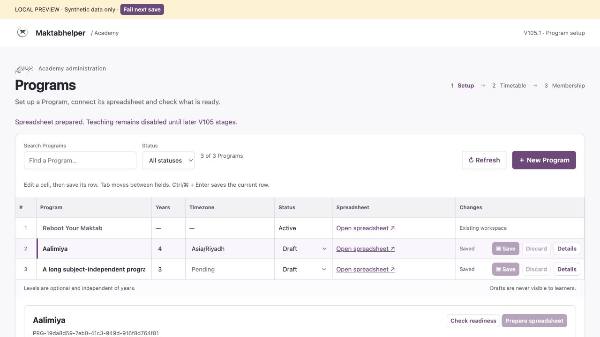
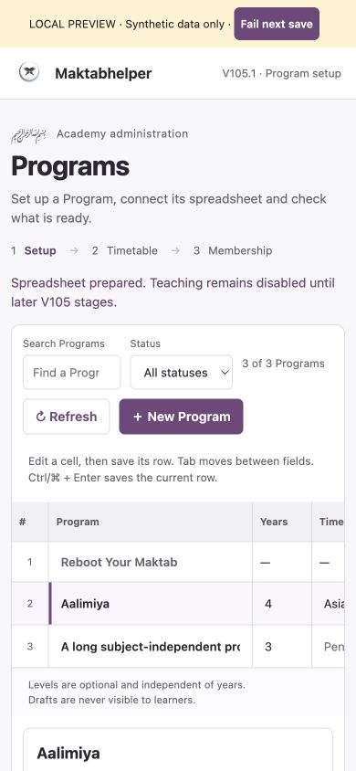

# V105.1 — Verification evidence

Date: 22 September 2026. Baseline commit: `5938c988cb5b589e1637b08f5c68c41115f2a0b7`.

## Automated checks

- Full backend regression suite: **69/69 test files passed** (68 existing files plus the new Program Builder integration test).
- JavaScript/MJS syntax: **167/167 files passed**. Subsequent small frontend/service changes were also checked directly.
- `git diff --check`: passed at release verification.
- Legacy read guardrails preserved: 23 direct read call sites across 17 existing files, at least 15 batch read call sites. The new Program repository adds exactly one isolated direct-read call site. This is a static guardrail, not a throughput benchmark.
- New Program list request reads are bounded independently of Program count: account, registry, Platform metadata and definitions; four Sheets reads in the integration fixture, no target-sheet fan-out.

The integration test executes the actual Worker, router, authentication, service, repository and Sheets request construction against an in-memory Google API mock. It covers missing/legacy/student/local-admin authority, revoked central authority, unsupported methods, invalid/oversized bodies, duration/timezone/status validation, capability activation refusal, duplicate/protected/operational mappings, stable create retries, response loss after commit, atomic registry/config/audit writes, save failure without a partial record, stale sequential revisions, archiving, failed/repeated/header-only/empty preparation, mismatched target ownership and legacy-data isolation.

No real Google service credentials are present in the fixtures. The test creates a temporary key pair in memory. Real network/API behavior and access permissions remain in Development acceptance.

## Browser checks

The actual frontend and domain service were exercised through the local synthetic-data preview in the Codex in-app browser. Checked at the normal desktop viewport and at 390 × 844 CSS pixels:

| Interaction | Observed result |
|---|---|
| Change Aalimiya timezone, inject one failed save | Error displayed; entered timezone retained; Save remained available. |
| Ctrl/⌘ + Enter in edited row | Row saved; Saved state and disabled save button appeared. |
| Prepare then check spreadsheet | Schema ready; timezone status shown separately; teaching remained disabled. |
| Create a Program with a long name | New stable ID; row saved; full name shown in its detail panel. |
| Tab from timezone | Focus moved to that row's status selector. |
| Search and status filter | Correct row count/empty state; filtered-out selected details hidden. |
| Change field then Discard | Saved value restored. |
| Refresh with unsaved changes | Inline warning; Keep editing retained the value; Discard and refresh restored the saved value. |
| Narrow layout | Toolbar wrapped, grid scrolled horizontally, row actions remained usable. Document width was 390 px while the table scroller contained 1100 px; the page itself did not overflow horizontally. |
| Browser console after the revised refresh test | No warning/error entries returned. |

A native confirmation dialog originally stalled the embedded test browser; the refresh interaction was changed to the tested inline warning. Browser-level `beforeunload` confirmation is implemented but not claimed as cross-browser verified.

Screenshots use synthetic data (including the demonstration timezone):

## Verification boundaries

Not verified here: live deployment, real service-account sharing, real Platform registration, end-to-end student teaching flows, concurrent Program mutations, supported-browser matrix, 60-plus-user capacity or beta sign-off. There is no claim of a distributed write lock. These checks must not be inferred from the local preview or mock tests.

Worker implementation review used the current [Cloudflare best-practices guidance](https://developers.cloudflare.com/workers/best-practices/workers-best-practices/) and `@cloudflare/workers-types` 5.20260922.1. No Worker bindings, compatibility flags or deployment settings were changed. New request data remains request-scoped; awaited writes, bounded request bodies, literal cell values and opaque random IDs follow the existing application architecture.
