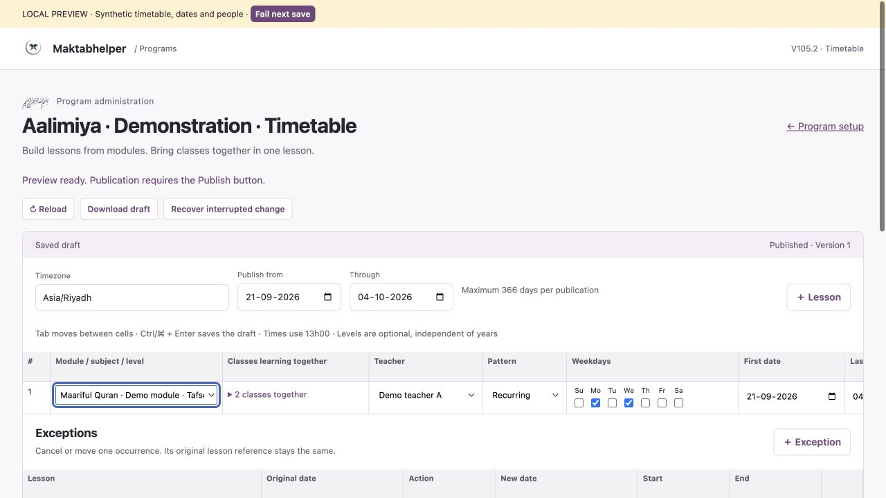
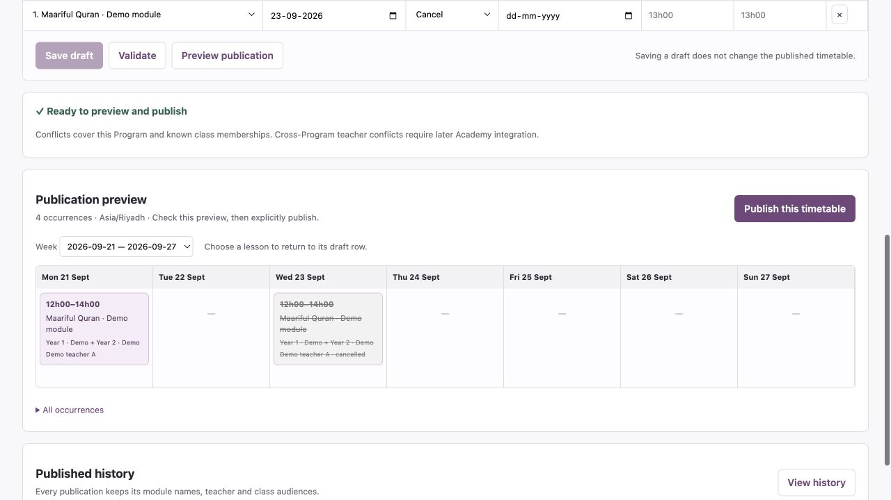
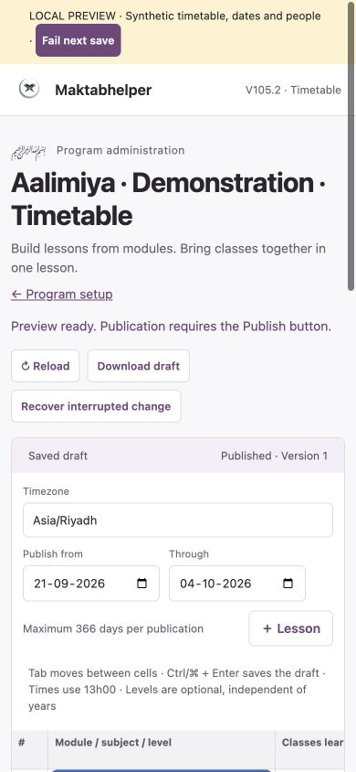
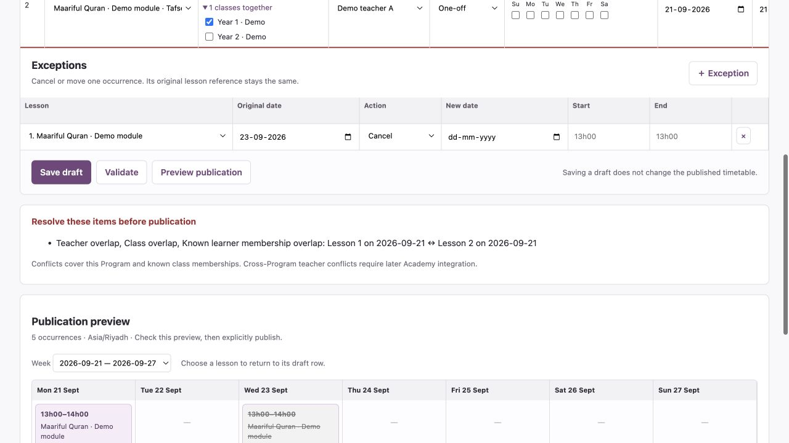

# V105.2 — Local verification

Release: **105.2.0**. Branch: `feature/v105.2-program-timetable`. Baseline: V105.1 local package over Development commit `5938c988cb5b589e1637b08f5c68c41115f2a0b7` (V104.5.4). Verification completed 24 September 2026.

## Automated checks

| Check | Result |
|---|---|
| Complete backend regression | **71/71 test files passed** |
| Repository JavaScript/MJS syntax | **179/179 files passed**; dependency/runtime output excluded |
| Program timetable domain/coordinator | Passed recurrence/one-off, multi-class audiences, optional-level ownership, timezone/DST, exceptions/anchors, overlap checks, draft isolation, history labels, stale edits, concurrent publication, lost responses, journal recovery, revocation and late old writes |
| Program timetable API with mocked Google transport | Passed real Worker routes, central authority, request bounds, empty/idempotent preparation, reference validation, atomic Sheets writes, receipts, recovery, canonical coordinator keys and legacy isolation |
| Same API tests through Cloudflare local runtime | **Passed**, using the exported Durable Object, SQLite journal and real RPC binding against synthetic Google responses; includes competing publications |
| Wrangler Development dry run | Passed; coordinator/R2/rate-limit bindings recognised; no deployment |
| Generated runtime/binding types | Passed with Wrangler 4.136.3, workerd 1.20260921.1; existing compatibility date retained |
| Legacy read budget | 23 direct call sites across 17 legacy files, plus one isolated Program setup adapter; 16 batch-read call sites |
| Diff whitespace/integrity | `git diff --check` passed |

Run the normal regression with `node backend/tests/run-all.mjs`. For the local runtime check, install the locked backend dependencies, create a bundle using `wrangler deploy --dry-run --env development --outdir /tmp/m4l-v1052-worker`, then run `node backend/tests/program-timetable-api.test.mjs /tmp/m4l-v1052-worker/worker-runtime.js` from the repository root. It uses synthetic account credentials and mocked Google responses, not real spreadsheets. Runtime module roots and Node/runtime Request/Response conversions are handled by the test harness.

The independent pure coordinator test recreates the coordinator around a persisted test journal after an interrupted write. The runtime integration verifies real SQLite journal/RPC operation and recovery; it does not claim a live Cloudflare eviction/load test.

## Browser checks

Verified in the Codex in-app browser against the loopback synthetic preview:

- Initial module/subject display, optional level omitted, combined Year 1/Year 2 class selection.
- Validation and weekly preview before explicit publication; publication updates the visible current-version label.
- Draft save after publication leaves history’s original `13h00` lesson time unchanged.
- Injected failed save keeps edited time, locks editing, exposes retry and succeeds with the same pending change.
- Cancellation selected by original occurrence date appears in the weekly preview.
- Calendar lesson selection returns focus to its module cell.
- Numeric `1300` entry normalises to `13h00` after Ctrl/⌘ + Enter saving.
- An overlapping one-off lesson surfaces teacher/class/known-learner conflicts and removes publication availability; affected grid rows are marked.
- Explicit discard/reload removes unsaved test edits; valid saved draft reloads successfully.
- 390 × 844 mobile layout: controls wrap, page remains contained and wide grids/calendar scroll within their sections. Viewport override reset afterwards.

Screenshots capture synthetic states during testing. The sample dates, timezone, teachers and module designation are not approved real curriculum or timetable data.

## Pending live acceptance

No GitHub push, cloud deployment, real Aalimiya registration, backend sharing change, real reference population or teaching publication was performed. Development/beta deployment checks, cross-browser/device coverage, actual spreadsheet permissions and real-data acceptance remain open in the [stage checklist](V105.2-IMPLEMENTATION-CHECKLIST.md). This does not prove 60-plus-user capacity. Cross-Program conflicts and student Academy delivery remain later-stage work; full membership and curriculum management remain V105.3/V105.4.
